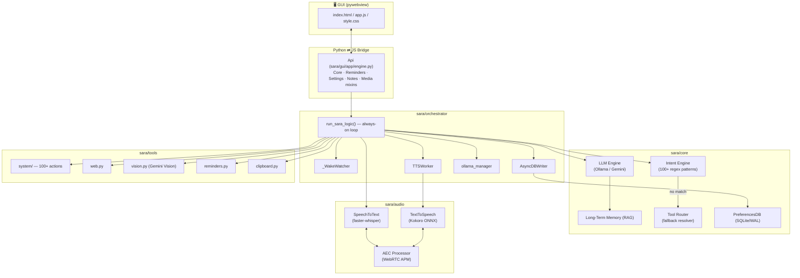
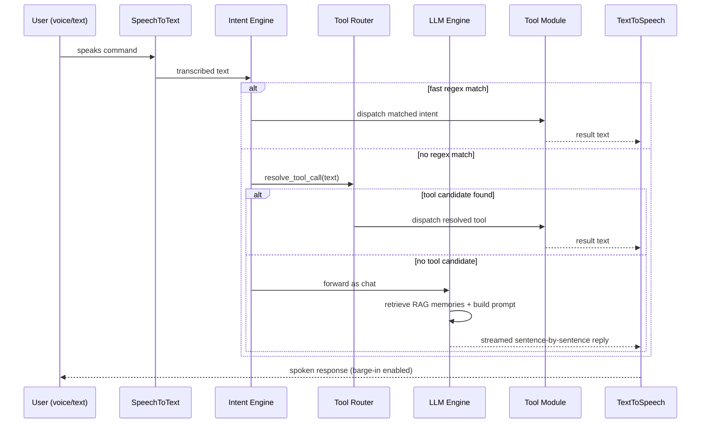
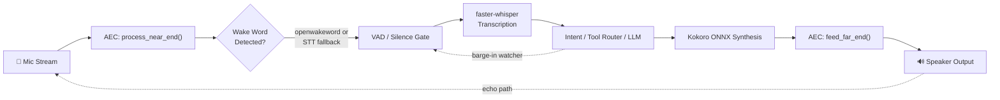
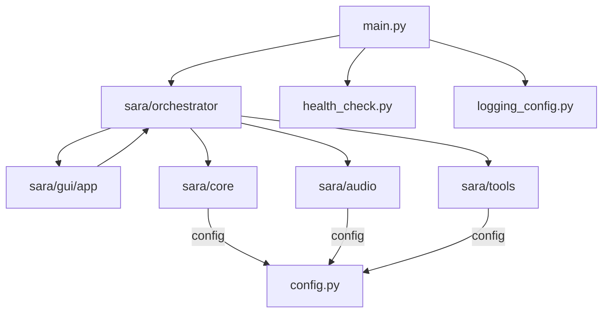
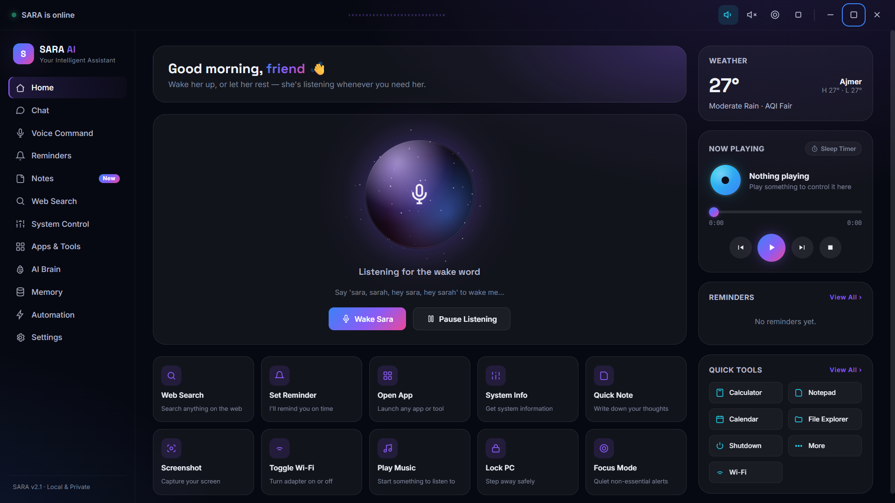
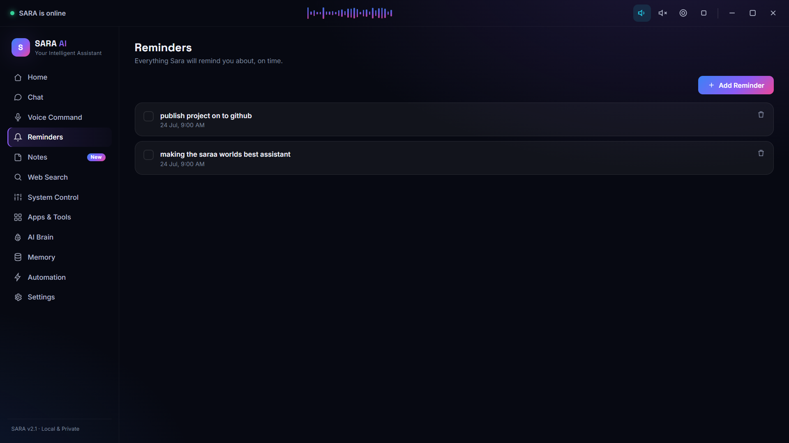
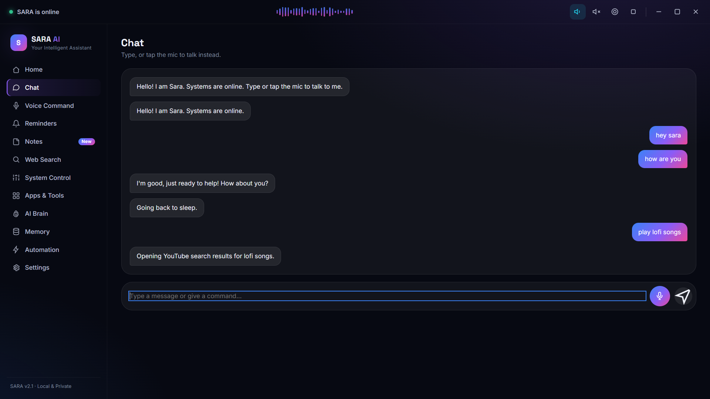
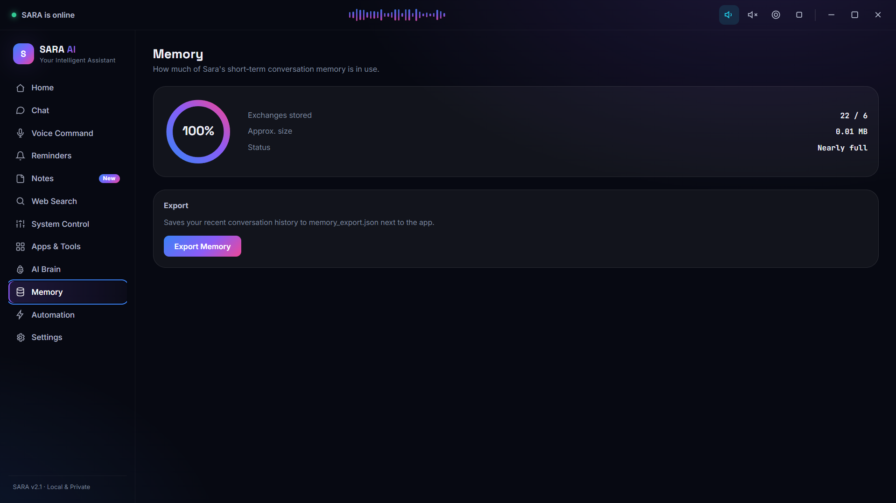
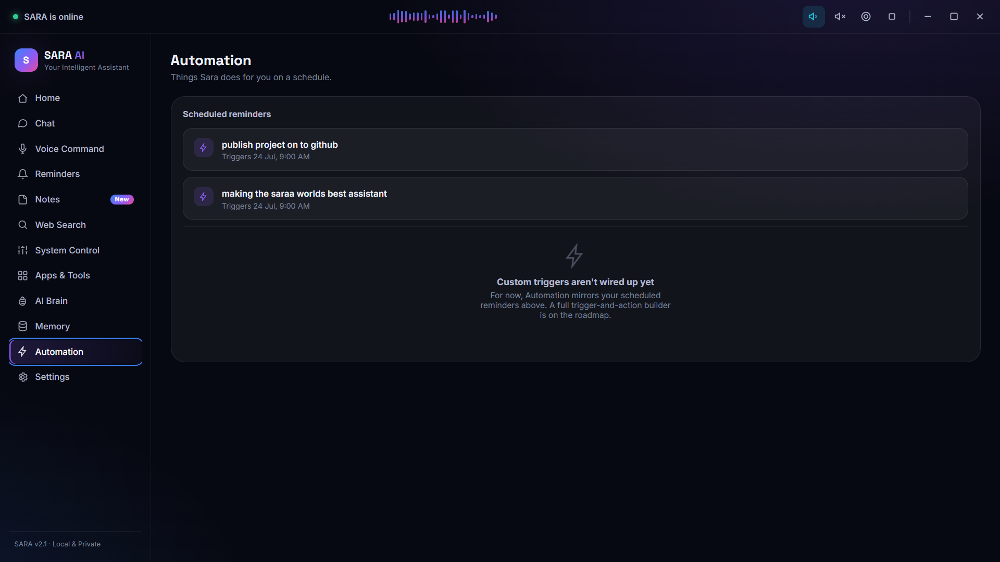
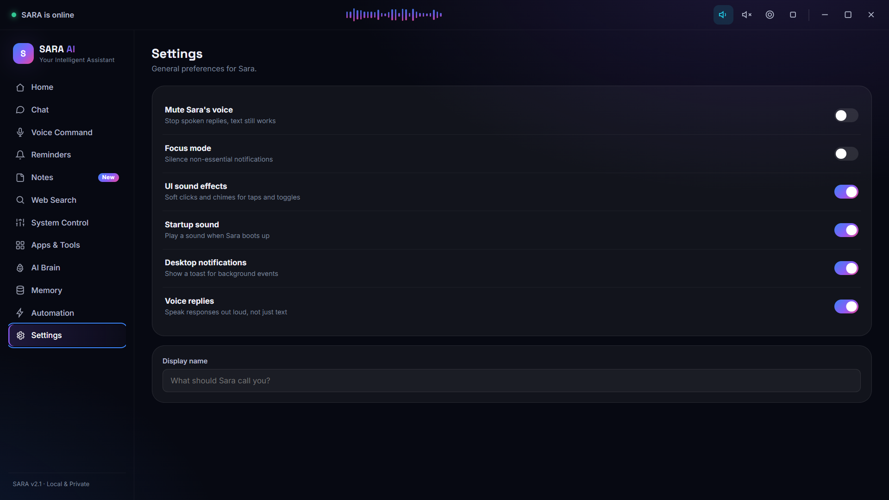

<div align="center">

# 🎙️ SARA AI

### An always-listening, bilingual, local-first desktop AI assistant

**Wake word → speech → intent → action, entirely on your own machine.**

[](https://www.python.org/)
[](./LICENSE)
[](#-installation)
[](https://github.com/manvendrasingh0712/SARA-AI-Automation-Powered-Personal-Desktop-Assistant/stargazers)
[](https://github.com/manvendrasingh0712/SARA-AI-Automation-Powered-Personal-Desktop-Assistant/commits)
[](https://github.com/manvendrasingh0712/SARA-AI-Automation-Powered-Personal-Desktop-Assistant/issues)
[](https://github.com/manvendrasingh0712/SARA-AI-Automation-Powered-Personal-Desktop-Assistant/pulls)

[Overview](#-project-overview) • [Features](#-key-features) • [Architecture](#-architecture) • [Installation](#-installation) • [Configuration](#-configuration-reference) • [Developer Guide](#-developer-guide)

</div>

---

## 📖 Project Overview

**Sara AI** is a Windows desktop AI assistant in the JARVIS mold: it wakes on a spoken name, listens, understands, talks back in a synthesized voice, and can reach out and actually *do things* on the machine it runs on — open apps, control volume and brightness, manage windows, set reminders, search the web, read your screen, and hold a genuine bilingual (English / Hindi / Hinglish) conversation.

It exists as a **local-first alternative to cloud voice assistants**: speech-to-text (`faster-whisper`), text-to-speech (Kokoro ONNX), and the conversational brain (Ollama) all run on-device by default. Nothing has to leave the machine unless you explicitly opt into the optional Gemini backend for chat or vision. That constraint — **fast, free, low-latency, no forced cloud dependency** — shapes almost every design decision in the codebase, from the regex-first intent router that resolves ~100 common commands without ever calling an LLM, to the GPU/CPU auto-fallback in the TTS pipeline.

**Who it's for:** it's a portfolio-grade reference implementation of a full voice-assistant stack — wake-word detection, VAD, real acoustic echo cancellation, streaming LLM inference, sentence-level TTS streaming with barge-in, long-term semantic memory, and a native-feeling desktop GUI — useful to anyone building a similar assistant, or evaluating the engineering behind one.

---

## ✨ Key Features

### 🧠 AI & Language
- **Dual LLM backend** — local [Ollama](https://ollama.com) (default, e.g. `qwen2.5`) or cloud [Gemini](https://ai.google.dev) (optional, opt-in via `.env`), with automatic retry/backoff and a warm-up wait for the local model
- **Streaming responses**, split sentence-by-sentence so speech can start before the full reply has finished generating
- **Bilingual conversation** — English, Hindi, and Hinglish, with distinct persona-tuned system prompts per language and a thread-safe `LanguageState` toggle driven from the GUI
- **Long-term semantic memory (RAG)** — every exchange is embedded (via Ollama's `/api/embeddings`, e.g. `nomic-embed-text`) and stored in SQLite; relevant past memories are retrieved by cosine similarity and injected back into context, so Sara can recall things mentioned sessions ago
- **Rule-based tool-call fallback** — when the fast regex intent router finds no match, a lightweight keyword-based resolver (`tool_router.py`) checks whether a known tool (weather, news, web search, app control, calculator, etc.) still applies before falling back to free-form chat

### 🎙️ Voice
- **Wake-word activation** — `openwakeword` model support (bring-your-own-trained model) with a built-in STT-based multi-variant fallback (`sara`, `sarah`, `hey sara`, `hey sarah`, fully customizable)
- **Local speech-to-text** via `faster-whisper`, tuned with configurable beam size, no-speech/log-prob/compression-ratio thresholds, and repetition-based hallucination filtering
- **Local text-to-speech** via **Kokoro ONNX**, GPU-accelerated (CUDA) with automatic CPU fallback, per-language voice/speed routing, a phrase-level LRU cache, and a persistent low-latency audio player
- **Real Acoustic Echo Cancellation (AEC)** — WebRTC Audio Processing Module (`aec-audio-processing`) cancels Sara's own speaker output from the mic input in real time, instead of relying on energy/VAD heuristics alone
- **Barge-in** — the user can interrupt Sara mid-sentence by simply speaking
- **Continuous conversation mode** with an idle timeout, so a full "wake word" isn't needed for every follow-up turn

### 🤖 Automation & System Control
- **~100+ system actions** across app launching/closing, volume & brightness, window management (snap/minimize/maximize/switch), media key control, keyboard shortcuts (copy/paste/undo/zoom/scroll/tab control), Wi-Fi & Bluetooth toggling, dark/light mode, folder shortcuts, Windows Settings deep-links, file operations, and system info (disk usage, uptime, local IP)
- **Reminders & timers** with a background checker thread and alarm playback
- **Notes** (take/read/clear) backed by a persisted notes file
- **Clipboard read/write**
- **Screen understanding** — captures a screenshot (`mss`) and describes it via a Gemini vision-capable model
- **Web tools** — search, news lookup, weather, article summarization/reading, opening URLs, launching YouTube/Spotify queries
- **Safe in-app calculator** — bounded custom expression evaluator (magnitude/exponent/depth caps) instead of a raw `eval()`

### 🖥️ UI
- **Native-feeling desktop GUI** built with `pywebview` (Python) + HTML/CSS/JS frontend — no Electron/browser overhead
- **11 pages**: Home, Chat, Voice, Memory, Brain, Automation, Apps, System, Web Search, Notes, Reminders, Settings
- Live system stats, glassmorphic styling, boot progress events pushed from the Python backend, and a persistent backend-disconnection banner

### 🧩 Memory
- **Short-term**: a bounded in-process conversation window (`MAX_MEMORY_EXCHANGES`)
- **Structured**: SQLite `preferences` and `conversation_log` tables (WAL mode)
- **Long-term/semantic**: the RAG store described above, in the same canonical SQLite file

### ⚡ Performance
- Fast-path **regex intent matching** (100+ patterns) runs before any LLM round-trip, with substring pre-filter "gates" to skip whole intent groups cheaply and an LRU cache for repeated commands
- Groupless multi-pattern intents are auto-merged into a single alternation regex to cut per-call regex engine invocations
- **Async, fire-and-forget DB writer** thread so conversation logging never blocks the voice loop
- Lazy background construction (`_Lazy`) of heavy objects so the GUI can appear before every model has finished loading
- ONNX Runtime thread/memory tuning (`ORT_INTRA_THREADS`, `ORT_INTER_THREADS`, CUDA memory cap) exposed as config

### 🔒 Reliability & Security
- **Bounded custom-eval calculator** — no raw `eval()` on user input
- Network tool calls (`web.py`) run with explicit timeouts so a hung request can't block the assistant indefinitely
- Raw exception text is never spoken aloud by TTS — every failure path returns a short, localized, user-facing message while the real exception goes to the logger
- Startup diagnostics (`health_check.py`) run before any heavy model is constructed, surfacing missing mic/speaker, an unreachable Ollama server, or missing model files immediately and loudly instead of failing deep inside audio/LLM init
- `ConfigError` (not `sys.exit`) on fatal misconfiguration, so `config.py` stays importable/testable in isolation
- CWD-independent `DB_PATH` / `NOTES_FILE_PATH`, resolved from the project root rather than the process's working directory

### 🛠️ Developer Experience
- Every former monolithic file (600–1,700+ lines) has been split into small, single-concern packages (`sara/audio/{stt,tts}/`, `sara/core/{llm,intent}/`, `sara/tools/system/`, `sara/gui/app/`, `sara/orchestrator/`) with each package's `__init__.py` re-exporting the original public names
- Smoke test suite (`tests/test_sara_smoke.py`) covering config validation, intent detection, the safe calculator, the preferences DB, reminder lifecycle, the tool router, and TTS initialization
- Centralized, validated, bounds-clamped configuration in `config.py` — every tunable is read from `.env` with a sane default and a clamped valid range
- Rotating file + console logging (`logging_config.py`) configured before any other module runs

---

## 🏗️ Architecture

Sara AI runs as a single Python process with three cooperating parts: a **pywebview GUI thread**, a **background "Sara logic" thread** (the always-on wake → listen → think → speak loop), and a set of **shared, thread-safe core services** (LLM, TTS, STT, memory, reminders) that both threads call into.

### High-Level Architecture



### Request / Command Flow



### Voice Pipeline (Wake → Listen → Speak)



### Module Dependency Overview



---

## 📁 Project Structure

```
SARA-AI-Automation-Powered-Personal-Desktop-Assistant/
├── main.py                      # Thin entry point (setup_logging → build_core_objects → launch GUI)
├── config.py                    # Centralized, validated, .env-driven configuration (Config class)
├── health_check.py              # Non-blocking startup diagnostics (mic/speaker, Ollama, model files)
├── logging_config.py            # Root logger setup — rotating file + console
├── requirements.txt              # Runtime dependencies
├── requirements-build.txt        # PyInstaller-only build dependencies
├── BUILD.md                      # Windows .exe packaging guide (PyInstaller)
├── CONTRIBUTING.md               # Contribution guidelines
├── LICENSE                       # MIT
│
├── sara/
│   ├── orchestrator/             # The always-on conversation loop, split by concern
│   │   ├── core_wiring.py        #   build_core_objects() + run_sara_logic()
│   │   ├── intent_handlers.py    #   One handler per fast-path regex intent
│   │   ├── ollama_manager.py     #   Start/stop/health-check the local Ollama server
│   │   ├── tts_worker.py         #   TTSWorker — speak/barge-in coordination
│   │   ├── db_writer.py          #   AsyncDBWriter — fire-and-forget conversation logging
│   │   ├── state.py              #   LanguageState, AssistantState
│   │   ├── calc_utils.py         #   Safe calculator eval + duration parsing
│   │   ├── network_utils.py      #   Bounded-timeout wrapper for network tool calls
│   │   ├── text_utils.py         #   Name-extraction / phrase-matching helpers
│   │   ├── history.py            #   Conversation history + preference restore
│   │   └── lazy.py               #   Background lazy-construction wrapper
│   │
│   ├── core/
│   │   ├── llm/                  # LLM engine — prompt.py, streaming.py, clients.py, engine.py
│   │   ├── intent/                # Regex intent router — patterns.py (data), engine.py (matching)
│   │   ├── memory.py               # PreferencesDB — SQLite/WAL preferences + conversation log
│   │   ├── rag.py                   # LongTermMemory — semantic long-term recall
│   │   └── tool_router.py            # Rule-based tool-call fallback resolver
│   │
│   ├── audio/
│   │   ├── stt/                   # SpeechToText — helpers.py, buffers.py, engine.py (faster-whisper)
│   │   ├── tts/                   # TextToSpeech — voice_params, text_prep, cache, synth, player, engine
│   │   └── aec.py                 # Acoustic Echo Cancellation wrapper (WebRTC APM)
│   │
│   ├── tools/
│   │   ├── system/                # 13 category files + dispatch.py (SIMPLE_ACTIONS table)
│   │   ├── web.py                 # Search, news, weather, page reading, URL/YouTube/Spotify launch
│   │   ├── vision.py              # Screenshot capture + Gemini-vision description
│   │   ├── reminders.py           # ReminderManager — background checker + alarm
│   │   └── clipboard.py           # Clipboard read/write
│   │
│   └── gui/
│       ├── app/                   # Api (pywebview JS-bridge), composed from 5 mixins
│       ├── index.html             # Frontend markup — 11 pages
│       ├── js/app.js              # Frontend logic — boot sequence, API calls, UI state
│       └── style/style.css        # Glassmorphic styling
│
└── tests/
    └── test_sara_smoke.py         # Smoke tests: config, intent, calc, DB, reminders, tool router, TTS
```

---

## 🧰 Technology Stack

| Category | Technology |
|---|---|
| **Language** | Python 3.10+ (uses `X \| None` union-type syntax throughout) |
| **LLM (default)** | [Ollama](https://ollama.com) — local, e.g. `qwen2.5` |
| **LLM (optional)** | Google Gemini (`google-genai`) — opt-in via `LLM_BACKEND=gemini` |
| **Embeddings** | Ollama `/api/embeddings` (e.g. `nomic-embed-text`) for RAG |
| **Speech-to-Text** | `faster-whisper` (CTranslate2-based Whisper) |
| **Wake Word** | `openwakeword` (custom model) with STT-based multi-variant fallback |
| **Text-to-Speech** | Kokoro ONNX (`kokoro-onnx`), GPU (CUDA) via `onnxruntime-gpu` with CPU fallback |
| **Echo Cancellation** | `aec-audio-processing` (WebRTC Audio Processing Module) |
| **Voice Activity Detection** | `webrtcvad` |
| **Audio I/O** | `sounddevice`, `PyAudio`, `pygame` (playback) |
| **GUI Framework** | `pywebview` (Python-native window) + HTML/CSS/JS frontend |
| **Database** | SQLite (WAL mode) — preferences, conversation log, long-term memory |
| **Vision** | Gemini vision model (`google-genai`) + `mss` (screenshot capture) + `Pillow` |
| **Web Tools** | `requests`, `beautifulsoup4`, `ddgs` (with `duckduckgo_search` legacy fallback) |
| **System Control (Windows)** | `psutil`, `pycaw`, `comtypes`, `keyboard`, `screen_brightness_control`, `pywin32` |
| **Utilities** | `dateparser`, `pyperclip`, `python-dotenv`, `numpy` |
| **Build / Packaging** | PyInstaller (`requirements-build.txt`, see `BUILD.md`) |
| **Package Manager** | pip / `requirements.txt` |

---

## 🚀 Installation

> **Platform note:** Sara AI is currently **Windows-only** — several dependencies (`pycaw`, `comtypes`, `pywin32`, `screen_brightness_control`, `keyboard`) and system-control code paths are Windows-specific.

### Prerequisites

- Python 3.10 or later
- [Ollama](https://ollama.com) installed and on `PATH` (for the default local LLM backend)
- A working microphone and speaker
- (Optional, for GPU-accelerated TTS/STT) an NVIDIA GPU with a compatible CUDA toolkit installed

### Windows

```bash
# 1. Clone the repository
git clone https://github.com/manvendrasingh0712/SARA-AI-Automation-Powered-Personal-Desktop-Assistant.git
cd SARA-AI-Automation-Powered-Personal-Desktop-Assistant

# 2. Create and activate a virtual environment
python -m venv venv
venv\Scripts\activate

# 3. Install runtime dependencies
pip install -r requirements.txt

# 4. Pull the local LLM and embedding models
ollama pull qwen2.5
ollama pull nomic-embed-text

# 5. Create your .env file (see Configuration below) and place the
#    Kokoro TTS model files under models/ (kokoro-v1.0.onnx, voices-v1.0.bin)

# 6. Run Sara
python main.py
```

### Linux / macOS

The core Python logic is cross-platform, but the system-automation layer (`sara/tools/system/`) and several dependencies (`pycaw`, `comtypes`, `pywin32`, `screen_brightness_control`, `keyboard`) are Windows-specific and are not currently supported on Linux or macOS. Cross-platform support is a listed goal — see [Roadmap](#-roadmap).

---

## ⚙️ Configuration

All configuration is centralized in `config.py` and driven by environment variables loaded via `python-dotenv`. Create a `.env` file in the project root (there is no `.env.example` checked into this copy of the repository — use the reference table below to build one) with any values you want to override; every setting has a built-in default.

`Config.validate()` runs automatically on import, clamps every numeric setting into a safe range, and prints a full debug dump of the active configuration when `DEBUG_MODE=true`.

Two file paths are resolved relative to `config.py`'s own location (not the process's working directory), so the app behaves identically regardless of where it's launched from:
- `DB_PATH` → `sara_data.db` (shared SQLite database — preferences, conversation log, long-term memory)
- `NOTES_FILE_PATH` → `sara_notes.txt`

---

## ▶️ Running the Project

### Development

```bash
python main.py
```

This runs `setup_logging()`, then `sara.gui.app.main()`, which builds every core object (LLM, TTS, STT, memory, reminders, vision) via `build_core_objects()`, starts the always-on `run_sara_logic()` loop on a background thread, and opens the pywebview window.

### Production / Standalone Executable

See [`BUILD.md`](./BUILD.md) for the full PyInstaller packaging guide. In short:

```bash
pip install -r requirements-build.txt
pyinstaller sara_ai.spec
```

This produces a one-folder Windows build at `dist/SaraAI/SaraAI.exe`. The Kokoro model files and your `.env` are copied next to the built executable rather than bundled inside it, so they can be updated without a full rebuild.

---

## 🖼️ Screenshots

### Home

### Voice Assistant


### Chat


### Memory


### Automation / System


### Settings


### Voice Assistant


## 💬 Usage Examples

Once running, activate Sara by saying her wake word (default: **"Sara"** or **"Sarah"**) and speak naturally, or type a command in the Chat page.

```
"Sara, what's the weather in Ajmer?"
"Open Chrome"
"Set a timer for 10 minutes"
"Remind me to call mom at 6 pm"
"Take a note: buy groceries after work"
"What's on my clipboard?"
"What's on my screen right now?"
"Search for the latest news about AI"
"Mera naam kya hai?"           ← recalled via long-term memory
"Lock my PC"
```

Fast, common commands (~100+ patterns covering reminders, timers, notes, clipboard, weather, system control, window management, media keys, browser shortcuts, and more) are matched instantly by the regex intent engine with no LLM round-trip. Anything that doesn't match falls through to the rule-based tool router, and finally to a full conversational LLM reply — all transparently, in the same voice loop.

---

## 📋 Configuration Reference

The tables below list every setting that actually exists in `config.py`, grouped by subsystem, with its default value.

<details>
<summary><b>LLM Backend</b></summary>

| Variable | Default | Description |
|---|---|---|
| `LLM_BACKEND` | `ollama` | `ollama` or `gemini` |
| `OLLAMA_MODEL` | `qwen2.5` | Local chat model name |
| `OLLAMA_HOST` | `http://localhost:11434` | Ollama server URL |
| `OLLAMA_TIMEOUT` | `30` | Request timeout (s) |
| `OLLAMA_NUM_CTX` | `2048` | Context window (tokens) |
| `OLLAMA_SUMMARY_NUM_CTX` | `4096` | Context window for summarization calls |
| `OLLAMA_NUM_PREDICT` | `300` | Max tokens generated per reply |
| `OLLAMA_KEEP_ALIVE` | `30m` | How long Ollama keeps the model loaded |
| `GEMINI_API_KEY` | *(empty)* | Required if `LLM_BACKEND=gemini` |
| `GEMINI_MODEL` | `gemini-2.5-flash` | Gemini chat model |
| `GEMINI_MAX_HISTORY_TOKENS` | `30000` | History trim budget |
| `LLM_MAX_RETRIES` | `2` | Retry attempts on failure |
| `LLM_RETRY_BASE_DELAY_S` | `1.5` | Base backoff delay |
| `LLM_RETRY_MAX_DELAY_S` | `8.0` | Max backoff delay |
| `LLM_WARMUP_WAIT_S` | `20.0` | Wait allowance for a cold-start local model |

</details>

<details>
<summary><b>Text-to-Speech (Kokoro ONNX)</b></summary>

| Variable | Default | Description |
|---|---|---|
| `KOKORO_MODEL_PATH` | `models/kokoro-v1.0.onnx` | Model weights path |
| `KOKORO_VOICES_PATH` | `models/voices-v1.0.bin` | Voice bank path |
| `KOKORO_USE_GPU` | `True` | Use CUDA execution provider if available |
| `CUDA_GPU_MEM_LIMIT_BYTES` | 3 GB | CUDA memory cap |
| `ORT_INTRA_THREADS` / `ORT_INTER_THREADS` | auto / `1` | ONNX Runtime threading |
| `KOKORO_VOICE_EN` / `KOKORO_LANG_EN` | `af_heart` / `en-us` | English voice |
| `KOKORO_VOICE_HI` / `KOKORO_LANG_HI` | `hf_alpha` / `hi` | Hindi voice |
| `KOKORO_SPEED` | `1.0` | Base speed (inherited by EN/HI unless overridden) |
| `KOKORO_SPEED_EN` / `KOKORO_SPEED_HI` | inherits `KOKORO_SPEED` | Per-language speed |
| `TTS_VOLUME` | `1.0` | Playback volume |
| `TTS_PLAYBACK_BUFFER_MS` | `40` | Output buffer size |
| `TTS_SD_LATENCY` | `low` | `sounddevice` latency mode |
| `TTS_WARMUP_WAIT_S` | `2.0` | Warm-up wait |
| `TTS_SYNTH_QUEUE_SIZE` / `TTS_PLAY_QUEUE_SIZE` | `12` / `6` | Pipeline queue sizes |
| `TTS_PHRASE_CACHE_SIZE` / `TTS_PHRASE_CACHE_MAXLEN` | `64` / `40` | Phrase-level synthesis cache |
| `TTS_BLEED_GUARD_MULTIPLIER` | `1.6` | Guard multiplier for TTS echo bleed detection |

</details>

<details>
<summary><b>Speech-to-Text (faster-whisper)</b></summary>

| Variable | Default | Description |
|---|---|---|
| `WHISPER_MODEL_SIZE` | `large-v3` | Whisper model size |
| `WHISPER_BEAM_SIZE` | `3` | Decoding beam size |
| `STT_NO_SPEECH_THRESHOLD` | `0.6` | No-speech probability threshold |
| `STT_LOG_PROB_THRESHOLD` | `-1.0` | Log-probability threshold |
| `STT_COMPRESSION_RATIO_THRESHOLD` | `2.4` | Hallucination heuristic |
| `STT_HALLUCINATION_MIN_REPEATS` | `3` | Repeats before flagged as hallucinated |
| `STT_LANGUAGE` | *(unset)* | Force a specific STT language |
| `STT_FORCE_LANG_FOR_HINGLISH` | `True` | Force Whisper to `hi` when `SARA_LANGUAGE` is Hindi/Hinglish |
| `STT_SETTLE_MIN_GAP_S` | `1.3` | Mic settle time after TTS stops |

</details>

<details>
<summary><b>Wake Word</b></summary>

| Variable | Default | Description |
|---|---|---|
| `WAKE_WORD` | `sara , sarah` | Primary wake word(s) |
| `WAKE_WORDS` | `sara,sarah,hey sara,hey sarah` | STT-fallback variant list |
| `WAKE_WORD_ALLOW_CUSTOM_ONLY` | `False` | Disable forced built-in variants |
| `WAKE_WORD_MODEL_PATH` | *(unset)* | Path to a custom-trained `openwakeword` model |
| `WAKE_WORD_COOLDOWN_S` | `2.0` | Re-trigger cooldown |
| `WAKE_WORD_THRESHOLD` | `0.5` | Detection confidence threshold |
| `WAKE_WORD_BEAM_SIZE` | `1` | Whisper beam size for wake detection |

</details>

<details>
<summary><b>Acoustic Echo Cancellation (AEC)</b></summary>

| Variable | Default | Description |
|---|---|---|
| `AEC_ENABLED` | `True` | Enable WebRTC APM echo cancellation |
| `AEC_SAMPLE_RATE` | `16000` | Must be 8000/16000/32000/48000 |
| `AEC_STREAM_DELAY_MS` | `80` | Speaker→mic round-trip estimate |
| `AEC_ENABLE_NS` | `True` | Noise suppression |
| `AEC_ENABLE_AGC` | `False` | Automatic gain control |
| `AEC_ENABLE_VAD` | `False` | APM's built-in VAD |

</details>

<details>
<summary><b>Barge-in, Continuous Mode & Assistant Identity</b></summary>

| Variable | Default | Description |
|---|---|---|
| `BARGE_IN_ENABLED` | `True` | Allow interrupting Sara mid-speech |
| `BARGE_IN_ENERGY_THRESHOLD` | `600` | Energy threshold to detect an interruption |
| `CONTINUOUS_MODE_TIMEOUT` | `180` | Idle seconds before returning to wake-word mode |
| `SARA_NAME` | `Sara` | Assistant's spoken name |
| `SARA_TIMEZONE` | `Asia/Kolkata` | Timezone for time-of-day prompt context |
| `SARA_LANGUAGE` | `hinglish` | `english` / `hindi` / `hinglish` |
| `LANG_DETECTION_MODE` | `auto` | `auto` or `manual` |
| `DEBUG_MODE` | `False` | Verbose debug logging |

</details>

<details>
<summary><b>Memory, RAG & Tool-Calling</b></summary>

| Variable | Default | Description |
|---|---|---|
| `MAX_MEMORY_EXCHANGES` | `6` | Short-term conversation window |
| `RAG_ENABLED` | `True` | Enable long-term semantic memory |
| `EMBEDDING_MODEL` | `nomic-embed-text` | Ollama embedding model |
| `EMBEDDING_TIMEOUT_S` | `4.0` | Embedding call timeout |
| `RAG_TOP_K` | `4` | Memories retrieved per turn |
| `RAG_MIN_SIMILARITY` | `0.55` | Minimum cosine similarity to include a memory |
| `RAG_MAX_IN_MEMORY` | `5000` | Max memory rows cached in RAM |
| `TOOL_CALLING_ENABLED` | `True` | Enable the rule-based tool-router fallback |
| `TOOL_CALLING_TIMEOUT_S` | `5.0` | Fallback resolution timeout |
| `VISION_MODEL` | `gemini-2.5-flash` | Gemini vision model for screen description |
| `REMINDER_CHECK_INTERVAL` | `5` | Reminder polling interval (s) |
| `DB_PATH` / `NOTES_FILE_PATH` | project-root-relative | Shared SQLite DB / notes file paths |

</details>

---

## 🧑‍💻 Developer Guide

**Adding a fast-path command:** add a new `(intent_name, [regex_patterns])` entry to `sara/core/intent/patterns.py`, then add a handler in `sara/orchestrator/intent_handlers.py`. Order matters — more specific patterns must come before broad fallbacks.

**Adding a zero-argument system action:** implement it in the relevant `sara/tools/system/*.py` category file, then register it in `SIMPLE_ACTIONS` in `sara/tools/system/dispatch.py`.

**Adding a tool-router fallback:** extend `TOOL_NAME_TO_INTENT` and the keyword-matching branches in `sara/core/tool_router.py`, and add a corresponding case in `build_fake_match()`.

**Adding a new LLM backend:** add a lazy client accessor alongside `_get_ollama_client` / `_get_gemini_client` in `sara/core/llm/clients.py`, and wire it into the streaming/generation logic in `sara/core/llm/engine.py`.

**Adding a GUI page:** add the page markup and `data-page` attribute in `sara/gui/index.html`, wire its state/behavior in `sara/gui/js/app.js`, and expose any new backend calls as a method on the relevant `Api*Mixin` class in `sara/gui/app/`.

**Structural convention:** new code should slot into the existing package split rather than growing any single file back toward the 600+ line range that originally prompted this project's modularization. If a file approaches ~300–400 lines and covers more than one concern, split it.

---

## 🚄 Performance

- Regex-based intent matching runs entirely locally and completes before any network/LLM call is attempted, for the ~100+ patterns it covers
- Substring pre-filter "gates" skip whole groups of intent patterns without running their regexes at all
- Groupless multi-pattern intents are compiled into a single alternation regex to reduce per-call regex engine invocations
- Repeated identical commands are served from an LRU cache (`detect_intent`) without re-running regex matching
- TTS synthesis is cached at the phrase level (LRU, bounded size) so repeated short replies don't re-synthesize
- Conversation logging is fire-and-forget via a background `AsyncDBWriter` thread, off the voice-loop hot path
- Heavy objects (LLM client, TTS/STT engines, vision) are constructed lazily in the background so the GUI can render before every model has finished loading
- ONNX Runtime intra/inter-op thread counts and CUDA memory limits are tunable, with lighter CPU-thread defaults when GPU execution is active (to avoid contention with STT/wake-word workers)
- SQLite runs in WAL mode with tuned `synchronous`, `cache_size`, and `mmap_size` pragmas for a single-writer, low-latency workload

---

## 🗺️ Roadmap

Based on the current implementation and its known open items:

- [ ] Custom-trained wake-word model (currently relies on the STT-based fallback by default)
- [ ] Cross-platform support (currently Windows-only due to `pycaw`/`comtypes`/`pywin32`/`screen_brightness_control`/`keyboard`)
- [ ] Proactive, context-aware suggestions (calendar-aware, system/battery-state-aware)
- [ ] Deeper automated test coverage for the pure-logic modules (`calc_utils`, `intent` matching, `text_utils`) beyond the current smoke-test suite

---

## 🤝 Contributing

Contributions are welcome — this started as a solo portfolio project, but issues, bug reports, and pull requests are encouraged.

1. Fork the repository and create a branch off `main`
2. Keep pull requests focused — one logical change each
3. Confirm `python -m py_compile` passes on any file you touch, and that `python main.py` still boots
4. New environment-configurable behavior should go through `config.py`, not be hardcoded
5. Follow the existing package-per-concern structure rather than growing a single file into a monolith again

See [`CONTRIBUTING.md`](./CONTRIBUTING.md) for the full guide.

---

## 📄 License

Released under the **MIT License** — see [`LICENSE`](./LICENSE) for the full text.

```
Copyright (c) 2026 Manav
```

---

## 🙏 Acknowledgements

Built on top of these open-source projects and services:

- [Ollama](https://ollama.com) — local LLM serving
- [Google Gemini](https://ai.google.dev) (`google-genai`) — optional cloud LLM & vision backend
- [faster-whisper](https://github.com/SYSTRAN/faster-whisper) — speech-to-text
- [Kokoro ONNX](https://github.com/thewh1teagle/kokoro-onnx) — text-to-speech
- [openwakeword](https://github.com/dscripka/openWakeWord) — wake-word detection
- [ONNX Runtime](https://onnxruntime.ai/) — TTS model inference (GPU/CPU)
- [WebRTC Audio Processing](https://webrtc.org/) (via `aec-audio-processing`) — acoustic echo cancellation
- [pywebview](https://pywebview.flowrl.com/) — native desktop GUI shell
- [pycaw](https://github.com/AndreMiras/pycaw) — Windows audio endpoint control
- [ddgs](https://github.com/deedy5/ddgs) / `duckduckgo_search` — web search
- [mss](https://python-mss.readthedocs.io/) — screenshot capture
- `numpy`, `sounddevice`, `PyAudio`, `pygame`, `webrtcvad`, `psutil`, `comtypes`, `keyboard`, `screen_brightness_control`, `dateparser`, `pyperclip`, `beautifulsoup4`, `requests`, `python-dotenv`, `Pillow`

---

<div align="center">

**Built by [Manvendra singh](mailto:manvendrasinghchauhan0712@gmail.com)**

</div>